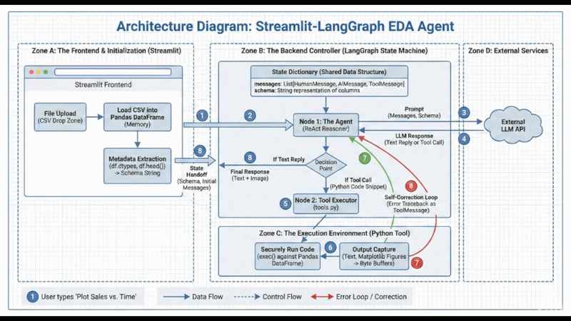

# 📊 Autonomous EDA Agent

An intelligent, autonomous Exploratory Data Analysis (EDA) tool built with **Streamlit**, **LangGraph**, and **OpenAI**. This agent acts as your personal Data Scientist: upload a CSV, ask questions in plain English, and the agent will dynamically write and execute Python code to analyze your data and generate visual plots.

## 🎥 Demo


## ✨ Features
* **Privacy-First Schema Reading:** The agent only reads the schema and data types (not the raw rows) to understand your dataset, keeping your data secure.
* **Autonomous Code Execution:** Uses a custom Python REPL tool to write and execute Pandas and Matplotlib code on the fly.
* **Stateful Conversations:** Built with LangGraph, the agent remembers chat history and maintains contextual awareness across prompts.
* **Auto-Correction:** If the generated code hits an error, the agent reads the traceback, debugs its own code, and tries again.
* **Dynamic Plotting:** Seamlessly captures Matplotlib visualizations and displays them directly in the chat interface.

## 🗂️ Project Structure
* `app.py`: The Streamlit frontend and chat interface. Handles file uploads, session state, and rendering agent outputs (text and images).
* `graph.py`: The core LangGraph architecture. Defines the state graph, system prompt, LLM integration, and tool bindings.
* `tools.py`: Contains the `execute_pandas_code` tool. Safely executes AI-generated Python code in a local environment, capturing standard output and Matplotlib plots.
* `requirements.txt`: Python dependencies required to run the application.

## 🚀 Getting Started

### Prerequisites
Make sure you have Python installed. You will also need an OpenAI API key.

### Installation

1. **Clone the repository:**
   ```bash
   git clone [https://github.com/abdurraafay90/Exploratory-Data-Analysis-Agent.git](https://github.com/abdurraafay90/Exploratory-Data-Analysis-Agent.git)
   cd Exploratory-Data-Analysis-Agent
   ```
   ## 🚀 Setup & Usage Guide

### 1️⃣ Install Dependencies
```bash
pip install -r requirements.txt
```

### 2️⃣ Set Up Environment Variables
Create a `.env` file in the root directory and add your OpenAI API key:

```env
OPENAI_API_KEY=your_api_key_here
```

### 3️⃣ Run the Application
```bash
streamlit run app.py
```

### 4️⃣ Open in Browser
After running the command, open your browser and go to:

```
http://localhost:8501
```

### 5️⃣ How to Use
- Upload a CSV file using the sidebar.
- Start asking questions like:
  - *"What is the correlation between column A and column B?"*
  - *"Can you plot a histogram of the sales data?"*
  - *"Are there any missing values in this dataset?"*

---

## 👨‍💻 Author

**Abdur Raafay**  
Computer Systems Engineering Student at NED University  
